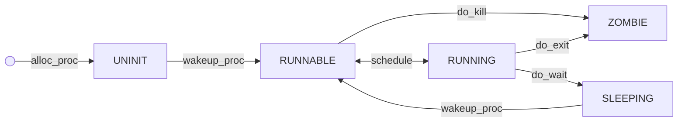

# 实验报告lab5
## 小组成员：2112430 薛浩，2110137 林楷达，2112557 石轹文


#### 练习一·加载应用程序并执行（需要编码）
* do_execv函数调用load_icode（位于kern/process/proc.c中）来加载并解析一个处于内存中的ELF执行文件格式的应用程序。你需要补充load_icode的第6步，建立相应的用户内存空间来放置应用程序的代码段、数据段等，且要设置好proc_struct结构中的成员变量trapframe中的内容，确保在执行此进程后，能够从应用程序设定的起始执行地址开始执行。需设置正确的trapframe内容。
* 请简要描述这个用户态进程被ucore选择占用CPU执行（RUNNING态）到具体执行应用程序第一条指令的整个经过。
```
     uintptr_t user_stack_top = USTACKTOP;//获取用户栈的顶部地址
     uintptr_t e_entry = elf->e_entry;//获取可执行文件的入口地址
     tf->gpr.sp = user_stack_top;//将进程状态结构体 tf 中的栈指针寄存器 sp 设为用户栈的顶部
     tf->epc = e_entry;//将进程状态结构体 tf 中的程序计数器 epc 设为可执行文件的入口地址。
     tf->status = sstatus;// 将进程状态结构体 tf 中的状态寄存器 status 设为操作系统的保存的状态寄存器的值
     tf->status &= ~SSTATUS_SPP; //清除进程状态结构体 tf 中状态寄存器 status 的 SPP 位
     tf->status |= (sstatus & SSTATUS_SPIE);//根据操作系统保存的状态寄存器值 sstatus 中的 SPIE 位，为进程状态结构体 tf 中状态寄存器 status 的 SPIE 位设置相应的值，以启用或禁用中断。
```
* 答：
* 在 ucore 中，当一个用户态进程被选择占用 CPU 执行（处于 RUNNING 状态）到具体执行应用程序的第一条指令的整个经过大致如下：

1. **选择进程运行**：
   - 调度器在合适的时机，例如在 init_main 中创建 user_main 进程后，会选择一个就绪态的用户进程执行。比如init_main 创建了 user_main 进程，调度器选中了这个进程。

2. **内核态处理**：
   - CPU 切换到内核态，开始执行调度器的代码。

3. **上下文切换**：
   - 调度器进行上下文切换，保存当前运行进程的状态并加载 user_main 进程的状态。这个过程包括保存当前进程的寄存器状态、程序计数器（PC）、栈指针等，并设置 user_main 的执行环境。

4. **切换至用户态**：
   - 当上下文切换完成后，CPU 切换回用户态，并且开始执行 user_main 进程。这时，user_main 进程已经处于 RUNNING 状态。

5. **执行应用程序第一条指令**：
   - 如果这是 user_main 进程首次执行，CPU 会从用户程序的入口地址开始执行。

#### 练习二·父进程复制自己的内存空间给子进程（需要编码）
* 创建一个内核线程需要分配和设置好很多资源。kernel_thread函数通过调用do_fork函数完成具体内核线创建子进程的函数do_fork在执行中将拷贝当前进程（即父进程）的用户内存地址空间中的合法内容到新进程中（子进程），完成内存资源的复制。具体是通过copy_range函数（位于kern/mm/pmm.c中）实现的，请补充copy_range的实现，确保能够正确执行。用户信息块。
```
//将 page 对应的物理页面映射到内核虚拟地址空间，得到了 kva_src 变量，表示源物理页的内核虚拟地址。
             void * kva_src = page2kva(page);
             //将 npage 对应的物理页面映射到内核虚拟地址空间，得到了 kva_dst 变量，表示目标物理页的内核虚拟地址。
             void * kva_dst = page2kva(npage);
             //使用 memcpy() 函数将 kva_src 指向的源物理页的内容拷贝到 kva_dst 指向的目标物理页中，拷贝的大小为 PGSIZE 字节，即一个页面的大小。
             memcpy(kva_dst, kva_src, PGSIZE);
             //调用了 page_insert() 函数，将目标物理页 npage 插入到页表 to 中的指定位置 start，并设置相应的权限perm。
             ret = page_insert(to, npage, start, perm);
             //使用断言来验证 page_insert() 函数返回的值 ret 是否为 0，如果不为 0，则断言会失败并导致程序终止。
             assert(ret == 0);
```
* 如何设计实现Copy on Write机制？给出概要设计，鼓励给出详细设计。
** 答：
** 1.数据结构设计：创建一个数据结构来表示共享资源，该结构包含一个引用计数器和一个指向数据的指针。引用计数器用于跟踪共享资源的使用情况。元数据结构中包含一个布尔标志来表示是否需要进行复制。
** 2.内存管理：当创建一个新的共享资源时，使用内存映射或动态内存分配来分配内存。将数据复制到新分配的内存中。将引用计数器设置为1，并将布尔标志设置为false。
** 3.共享资源访问：当一个进程需要访问共享资源时，它首先检查布尔标志。如果布尔标志为true，则需要复制数据。首先分配一块新的内存。将数据复制到新的内存中。将引用计数器设置为1，并将布尔标志设置为false。如果布尔标志为false，则增加引用计数器。
** 4.资源释放：当引用计数器变为0时，表示没有进程正在使用资源。释放资源的内存。

#### 练习三·阅读分析源代码，理解进程执行 fork/exec/wait/exit 的实现，以及系统调用的实现（不需要编码）
* 请在实验报告中简要说明你对 fork/exec/wait/exit函数的分析。并回答如下问题：

* · 请分析fork/exec/wait/exit的执行流程。重点关注哪些操作是在用户态完成，哪些是在内核态完成？内核态与用户态程序是如何交错执行的？内核态执行结果是如何返回给用户程序的？
* · 请给出ucore中一个用户态进程的执行状态生命周期图（包执行状态，执行状态之间的变换关系，以及产生变换的事件或函数调用）。（字符方式画即可）
** 答：
- 简要对 fork/exec/wait/exit函数进行分析。

  1. **`sys_exit`函数：**
     - 该函数用于实现系统调用 `sys_exit`，其目的是让当前进程退出。
     - 通过获取参数中的错误码，然后调用 `do_exit` 函数执行实际的退出操作。
  2. **`sys_fork`函数：**
     - 该函数用于实现系统调用 `sys_fork`，其目的是创建一个新的进程，即进行进程的复制。
     - 获取当前进程的上下文信息（trapframe），然后调用 `do_fork` 函数来完成进程的复制。
  3. **`sys_wait`函数：**
     - 该函数用于实现系统调用 `sys_wait`，其目的是等待子进程的退出。
     - 通过获取参数中的子进程PID和存储状态的指针，然后调用 `do_wait` 函数来等待指定的子进程退出。
  4. **`sys_exec`函数：**
     - 该函数用于实现系统调用 `sys_exec`，其目的是加载一个新的程序执行，替代当前进程的执行。
     - 通过获取参数中的程序名、程序名长度、二进制数据和大小，然后调用 `do_execve` 函数来完成执行新程序的操作。
  5. **`do_fork`函数：**
     - 该函数用于实现进程的复制，包括分配新的 `proc_struct`，分配新的内核堆栈，复制或共享内存管理信息，设置新进程的上下文信息，将新进程插入到进程链表等。
     - 在复制完成后，将新进程设置为可调度状态，并返回新进程的PID。
  6. **`do_exit`函数：**
     - 该函数用于实现进程的退出，包括释放内存空间，处理父进程等待子进程的情况，将进程状态设置为 `PROC_ZOMBIE`，并最终进行调度。
  7. **`do_execve`函数：**
     - 该函数用于执行进程替换操作，包括释放当前进程的内存空间，加载新的程序，设置新的程序名，最终进行调度。
  8. **`do_wait`函数：**
     - 该函数用于实现等待子进程退出的操作，包括查找指定PID的子进程，等待子进程退出，并释放相关资源。

  函数具体执行过程在分析执行流程时再作介绍。


- 请分析fork/exec/wait/exit的执行流程。重点关注哪些操作是在用户态完成，哪些是在内核态完成？内核态与用户态程序是如何交错执行的？内核态执行结果是如何返回给用户程序的？

  执行流程概括如下：

  1. **用户态的系统调用触发：**
     - 用户态的程序通过库函数（如`fork`、`exec`、`wait`、`exit`等）发起系统调用。
     - 库函数会使用特定的指令（例如 `ecall` 指令）来触发一个中断，将控制权转交给操作系统内核。

  2. **异常处理和内核态的系统调用函数：**
     - 中断发生后，操作系统的异常处理程序（异常处理 handler）被调用。
     - 异常处理程序首先保存当前被中断的程序的上下文，包括程序计数器和寄存器状态，通常保存在一个数据结构中，例如 `trapframe`。
     - 异常处理程序设置中断返回地址，然后调用内核态的 `syscall` 函数。

  3. **内核态的 syscall 函数处理：**
     - `syscall` 函数通过检查 `trapframe` 中的系统调用号来确定应该执行哪个系统调用服务函数。
     - 它从 `trapframe` 中获取用户传递的参数，将控制权转交给特定的系统调用服务函数。

  4. **系统调用服务函数执行：**
     - 系统调用服务函数在内核态执行，可以访问用户传递的参数和其他内核数据结构。
     - 服务函数执行相应的操作，可能会调用其他内核函数来完成任务，如进程管理、文件操作等。

  5. **服务函数返回和用户态恢复：**
     - 服务函数执行完毕后，控制权回到 `syscall` 函数。
     - `syscall` 函数将结果（如果有的话）返回到 `trapframe`。
     - `iret` 指令被用来从中断返回，将控制权返回到用户程序。
     - 用户程序恢复执行，并可以检查系统调用的结果。
     
     

  几个过程的具体执行流程：

  `fork` ：

  1. 程序调用 `fork`。

  2. `fork` 使用了系统调用 `SYS_fork`。

  3. `SYS_fork` 主要由 `do_fork` 和 `wakeup_proc` 完成。

  4. `do_fork` 完成以下工作：
     - 分配并初始化进程控制块（`alloc_proc` 函数）。
     
     - 分配并初始化内核栈，为内核进程建立栈空间（`setup_kstack` 函数）。
     
     - 根据 `clone_flag` 标志复制或共享进程内存管理结构（`copy_mm` 函数）。
     
     - 设置进程在内核正常运行和调度所需的中断帧和执行上下文（`copy_thread` 函数）。
     
     - 为进程分配一个 PID（`get_pid()` 函数）。
     
     - 将设置好的进程控制块放入 `hash_list` 和 `proc_list` 两个全局进程链表中。
     
     - 进程准备好执行，状态设置为“就绪”态，`wakeup_proc` 设置进程状态为 RUNNABLE。
     
     - 设置返回码为子进程的 PID 号。
     
       

  `exec` ：

  1. 当应用程序执行时，会调用系统调用 `SYS_exec`。
  2. `SYS_exec` 的功能主要由 `do_execve` 函数实现。
  3. `do_execve` 函数完成以下工作：
     - 为加载新的执行码做好用户态内存空间清空准备。
     - 如果当前进程的内存管理结构 `mm` 不为 `NULL`，则设置页表为内核空间页表，并释放进程所占用的用户空间内存和进程页表本身所占用的空间（如果引用计数减为 0）。
     - 将当前进程的 `mm` 指针置为 `NULL`。
     - 加载应用程序执行码到当前进程的新创建的用户态虚拟空间中。
     - 调用 `load_icode` 使进程准备好执行。

  

  `wait` ：

  1. 当执行 `wait` 功能时，会调用系统调用 `SYS_wait`。
  2. `SYS_wait` 的功能主要由 `do_wait` 函数实现。
  3. `do_wait`函数完成以下工作：
     - 如果 `pid != 0`，表示只找一个进程 ID 号为 `pid` 的退出状态的子进程，否则找任意一个处于退出状态的子进程。
     - 如果找到的子进程的执行状态不为 `PROC_ZOMBIE`，表示子进程还没有退出，当前进程设置执行状态为 `PROC_SLEEPING`（睡眠）并等待子进程退出。
     - 如果找到的子进程的执行状态为 `PROC_ZOMBIE`，表示子进程处于退出状态，当前进程（即子进程的父进程）完成对子进程的最终回收工作，包括从两个进程队列 `proc_list` 和 `hash_list` 中删除子进程的控制块，并释放子进程的内核堆栈和控制块。

  

  `exit` ：

  1. 当执行 `exit` 功能时，会调用系统调用 `SYS_exit`。
  2. `SYS_exit` 的功能主要由 `exit` 函数实现。
  3. `exit` 函数完成以下工作：
     - 调用 `do_exit` 函数回收用户进程占用的用户态虚拟内存空间。
     - 在 `do_exit` 中，首先释放用户虚拟内存空间相关的资源。
     - 设置当前进程的状态为 `PROC_ZOMBIE`，表示进程已退出，同时设置当前进程的退出码为 `error_code`，表示此进程已经无法再被调用，只能等到父进程来回收。
     - 如果父进程处于等待子进程的状态，唤醒父进程，让父进程来回收子进程所占用的资源。
     - 遍历当前进程的所有子进程：
        - 如果当前进程还有子进程，则需要把这些子进程的父进程指针设置为内核线程 `initproc`，并加入 `initproc` 的子进程链表。
        - 如果子进程的执行状态是僵尸状态，提醒 `initproc` 回收这个子进程。
     - 最后执行 `schedule` 函数，切换到其他进程。


- 请给出ucore中一个用户态进程的执行状态生命周期图（包括执行状态，执行状态之间的变换关系，以及产生变换的事件或函数调用）。



### 知识点：
* 1.操作系统应当提供给用户程序一些接口，让用户程序使用操作系统提供的服务。这些接口就是系统调用。
* 2.系统调用，是用户态(U mode)的程序获取内核态（S mode)服务的方法，所以需要在用户态和内核态都加入对应的支持和处理。
* 3.在用户态进行系统调用的核心操作是，通过内联汇编进行ecall环境调用。这将产生一个trap, 进入S mode进行异常处理。
* 4.用户进程与内核进程相比有两个栈，分别是内核栈和用户栈。
